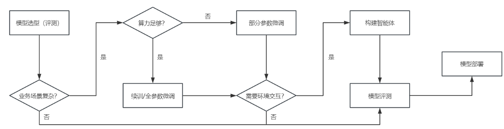

<h1 align="center">书生 · 浦语全链条开源开放体系</h1>

## 大模型成为发展通用人工智能的重要途经

1. 专用模型：针对特定任务，一个模型解决一个问题

   eg. 人脸识别；德州扑克；AlphaGo

2. 通用大模型：一个模型应对多种任务，多种模态

   eg. ChatGPT；GPT-4

## 书生 · 浦语大模型系列

1. 轻量级：`InterLM-7B`

   - 70亿模型参数，小巧轻便，便于部署
   - 1000亿训练 token 数据，信息全面，能力多维
   - 具备长语境能力
   - 具备通用工具调用能力

   社区低成本可用最佳模型规模

2. 中量级：`InterLM-20B`

   - 200亿参数量，在模型能力与推理代价之间取得平衡
   - 深而窄的结构，降低推理计算量的同时提高推理能力
   - 4k训练语境长度

   商业场景可开发定制高精度，同时开源可用

3. 重量级：`InterLM-123B`

   - 1230亿参数量，性能强大
   - 推理能力强，覆盖范围广
   - 准确的 API 调用能力，可实现各类 Agent

## 从模型到应用

### 具体流程

> 模型选型：从开源社区提供的模型中关注模型不同维度的能力（针对应用场景）
>
> 业务场景复杂：如果业务场景复杂直接用开源模型无法满足需求；反之在简单场景中可以通过 prompt engineering 的方式接入
>
> 模型微调：包括续训和全参数微调
>
> 部分参数微调：将大部分参数固定，只取调小部分参数
>
> 需要环境交互：可能会调用外部 API，或者和已有的数据库交互
>
> 构建智能体：更容易在业务场景里有更好的表现
>
> 模型部署：怎样以更少的资源部署，如何提升应用的吞吐量

### 全链条开源开放体系

#### 数据——书生 · 万卷1.0

包含大量文本数据，图像-文本数据集以及视频数据，总数据量约2TB

- **多模态融合**

  包含文本、图像和视频等多模态数据，涵盖科技、文学、媒体、教育和法律等多个领域，该数据集对模型的知识内容、逻辑推理和泛化能力有显著提升。

  > 模型泛化能力是指在一个模型面对新的、未见过的数据时，能够正确理解和预测这些数据的能力

- **精细化处理**

  经过语言筛选、文本提取、格式标准化、数据过滤和清洗（基于规则和模型）、多尺度去重和数据质量评估等精细数据处理环节，能够很好地适应后续模型训练要求

- **价值观对齐**

  注重将数据内容与主流中国价值观对齐，提高语料库的纯净度

> [`OpenDataLab`开源数据集平台](https://opendatalab.com/)

#### 预训练——InterLM-Train

- **高可扩展**

  支持从8卡到千卡训练，千卡加速效率达92%

- **极致性能优化**

  `Hybrid Zero` 独特技术+极致优化，加速50% 

- **兼容主流**

  兼容 `HuggingFace` 等技术生态，支持各类轻量化技术

- **开箱即用**

  支持多种规格语言模型，修改配置即可训练

#### 微调——XTuner

`XTuner` 可以适配多种生态，包含多种微调算法，并实现自动优化加速。同时 `XTuner` 适配多种硬件，能够在消费级显卡（8GB）上进行微调。

- **增量续训**

  让基座模型学习到新知识，如某个垂类领域知识

  训练数据：文章、书籍、代码

- **有监督微调**

  让模型学会理解和遵循各种指令，或者注入少量领域知识

  训练数据：高质量对话、问答数据

  - **全量参数微调**

  - **部分参数微调**

    将预训练权重固定住，引入新的较小的可训练参数来做参数微调

#### 评测——OpenCompass

6大维度（学科、语言、知识、理解、推理、安全），80+评测数据集，40万+评测题目

`OpenCompass` 评测平台分为4层

1. **模型层**

   基座模型、对话模型

2. **能力层**

   通用能力、特色能力

3. **方法层**

   自动化客观评测、基于模型辅助的主观评测、基于人类反馈的主观评测

4. **工具层**

   分布式评测、提示词工程、评测报告生成

#### 部署——LMDeploy

`LMDeploy` 提供大模型在 GPU 上部署的全流程解决方案，包括模型轻量化、推理和服务。

- **高效推理引擎**
  - 持续批处理技巧
  - 深度优化的低比特计算 kernel
  - 模型并行
  - 高效的 k/v 缓存管理机制
- **完备易用的工具链**
  - 量化、推理、服务全流程
  - 无缝对接 `OpenCompass` 评测推理精度
  - 和 `OpenAI` 接口高度兼容的 API server

> 静态推理性能：固定 batch，输入/输出 token 数量来评测吞吐量
>
> 动态推理性能：在真实对话场景里用不定长的输入/输出来评测请求吞吐量

#### 智能体框架——Lagent

- 支持多种类型的智能体能力
- 灵活支持多种大语言模型
- 简单易扩展，支持丰富的工具

#### 智能体工具箱——AgentLego

- 丰富的工具集合，尤其是计算机视觉、多模态等相关领域的前沿算法功能
- 支持多个主流智能体系统，如 LangChain、Transformers Agent、Lgent 等
- 多模态工具调用接口灵活，支持各类输入输出格式的工具函数
- 一键式远程工具部署，轻松使用和调试大模型智能体