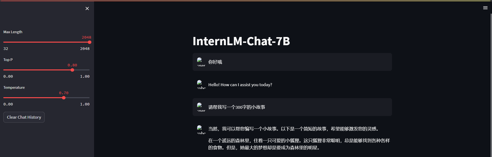
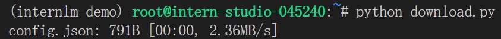
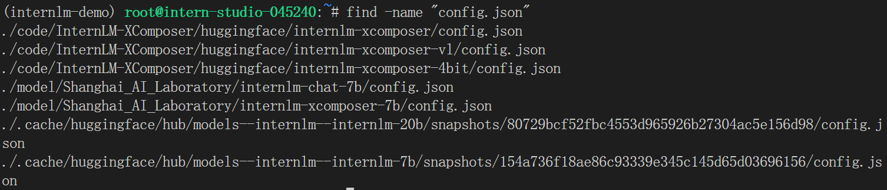

<h1 align="center">Lecture 2——HW2</h1>

## 1 使用 InternLM-Chat-7B 模型生成 300 字的小故事

### 1.1 环境配置

使用 [InternStudio](https://studio.intern-ai.org.cn/) 平台，选择 `A100(1/4)` 配置，使用 `Cuda11.7-conda` 镜像。进入到开发机后，输入 `bash` 进入 `conda` 环境。使用如下命令从本地克隆一个已有的 `pytorch 2.0.1` 环境：

```
bash /root/share/install_conda_env_internlm_base.sh internlm-demo
```

激活环境后安装运行 demo 时所需的依赖：

```
conda activate internlm-demo
python -m pip install --upgrade pip

pip install modelscope==1.9.5
pip install transformers==4.35.2
pip install streamlit==1.24.0
pip install sentencepiece==0.1.99
pip install accelerate==0.24.1
```

### 1.2 模型下载

由于在 `share` 目录下已经有了全系列的 `InternLM` 模型，因此我们可以新建一个文件夹之后直接进行复制：

```
mkdir -p /root/model/Shanghai_AI_Laboratory
cp -r /root/share/temp/model_repos/internlm-chat-7b /root/model/Shanghai_AI_Laboratory
```

> `-r` 表示递归地复制目录及其内容

### 1.3 代码准备

代码准备

在 `/root` 路径下新建 `code` 目录，将 `github` 上的代码 `clone` 到该目录下：

```
cd /root/code
git clone https://gitee.com/internlm/InternLM.git
```

由于需要与教程版本保持一致，因此需要切换 commit 版本：

```
mkdir -p /root/model/Shanghai_AI_Laboratory
cp -r /root/share/temp/model_repos/internlm-chat-7b /root/model/Shanghai_AI_Laboratory
```

最后将将 `/root/code/InternLM/web_demo.py` 中 29 行和 33 行的模型更换为本地的 `/root/model/Shanghai_AI_Laboratory/internlm-chat-7b`。

### 1.4 Web demo 运行

运行 `/root/code/InternLM` 目录下的 `web_demo.py` 文件，输入以下命令：

```
bash
conda activate internlm-demo  # 首次进入 vscode 会默认是 base 环境，所以首先切换环境
cd /root/code/InternLM
streamlit run web_demo.py --server.address 127.0.0.1 --server.port 6006
```

接下来配置本地端口。由于在之前已经生成过 SSH 密钥对，因此我们直接用 cat 进行查看：


接下来将这段内容复制下来，回到 `InternStudio` 控制台，点击配置 `SSH Key`，将复制的公钥添加即可。最终结果如下：


查看开发机端口号，在本地终端输入以下指令，其中`36521`是开发及的端口号：

```
ssh -CNg -L 6006:127.0.0.1:6006 root@ssh.intern-ai.org.cn -p 36521
```

vscode 终端显示如下结果：


在浏览器中打开 `http://127.0.0.1:6006` 页面，等待模型加载完之后，就可以与 `InternLM-Chat-7B` 进行对话了，结果如下图所示：



**小故事具体内容如下：**

当然，我可以帮您编写一个小故事。以下是一个简短的故事，希望能够激发您的灵感。

在一个遥远的森林里，住着一只可爱的小狐狸。这只狐狸非常聪明，总是能够找到各种各样的食物。但是，她最大的梦想却是要成为森林里的明星。

有一天，小狐狸决定去寻找一种神奇的魔法，可以让她变得更美丽。她听说这种魔法只有一只神秘的蝴蝶才能找到。于是，小狐狸开始了她的冒险之旅。

她在森林里走了很长时间，终于遇到了那只神秘的蝴蝶。蝴蝶告诉小狐狸，只有通过勇气和毅力，才能获得这种魔法。小狐狸毫不犹豫地接受了挑战。

她开始了一场激烈的冒险，穿越了森林和山脉，最终到达了魔法师的城堡。但是，魔法师拒绝了她的请求，因为他认为小狐狸还不够勇敢和坚强。

小狐狸并没有放弃，她继续前进，最终找到了魔法师。她告诉魔法师，她已经变得更加勇敢和坚强了，而且她也获得了一些非常宝贵的经验。魔法师听了之后，决定让她获得魔法。

小狐狸终于获得了魔法，她的皮肤变得更加美丽，眼睛变得更加明亮。她回到森林里，向其他动物展示她的魔法。她的勇气和坚韧让她成为了森林里最受欢迎的人物。

从此以后，小狐狸的生活变得更加丰富多彩，她也更加自信和勇敢。她学会了用自己的方式去冒险，去探索，去发现自己的梦想。

这就是一个小狐狸的故事，它告诉我们，只要我们有勇气和毅力，就能够实现自己的梦想。

## 2 下载 `InternLM-20B` 的 config.json 文件到本地

首先我们进入到根目录下创建一个 `download.py` 的文件来下载文件，python 代码如下：

```python
import os 
from huggingface_hub import hf_hub_download  # Load model directly 

hf_hub_download(repo_id="internlm/internlm-20b", filename="config.json")
```

在终端运行该文件，得到如下结果：



接下来我们尝试使用 `find` 命令查找根目录下所有名为 `config.json` 的文件：



可以看到倒数第二个是我们下好的文件，我们使用 `cat` 命令来查看它的具体内容，得到如下结果：

```
{
  "architectures": [
    "InternLMForCausalLM"
  ],
  "auto_map": {
    "AutoConfig": "configuration_internlm.InternLMConfig",
    "AutoModel": "modeling_internlm.InternLMForCausalLM",
    "AutoModelForCausalLM": "modeling_internlm.InternLMForCausalLM"
  },
  "bias": false,
  "bos_token_id": 1,
  "eos_token_id": 2,
  "hidden_act": "silu",
  "hidden_size": 5120,
  "initializer_range": 0.02,
  "intermediate_size": 13824,
  "max_position_embeddings": 4096,
  "model_type": "internlm",
  "num_attention_heads": 40,
  "num_hidden_layers": 60,
  "num_key_value_heads": 40,
  "pad_token_id": 2,
  "pretraining_tp": 1,
  "rms_norm_eps": 1e-06,
  "tie_word_embeddings": false,
  "torch_dtype": "bfloat16",
  "transformers_version": "4.33.1",
  "use_cache": true,
  "vocab_size": 103168,
  "rotary": {
    "base": 10000,
    "type": "dynamic"
  }
}
```

