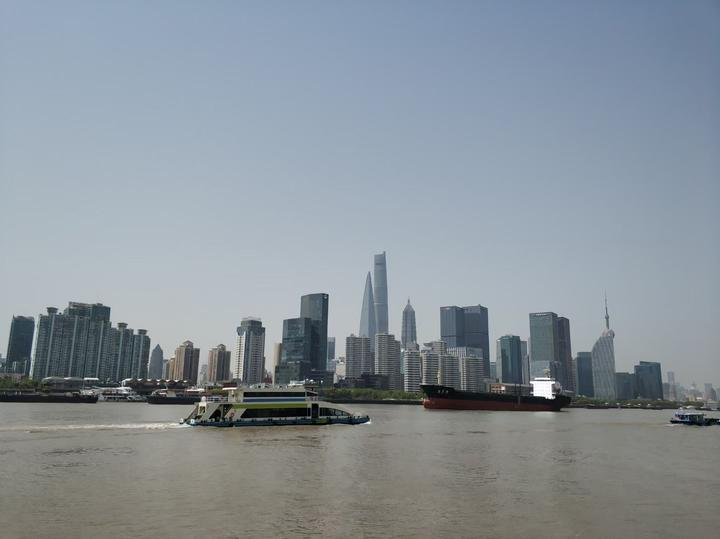

Shanghai is the largest city in China and one of the most populous cities in the world, with a population of over 24 million people. The city is known for its modern skyscrapers, bustling financial district, and vibrant nightlife. Shanghai is also home to some of the country's top tourist attractions, including the Bund, Yuyuan Garden, and the Oriental Pearl Tower. In this guide, we'll provide you with all the information you need to plan your trip to Shanghai, including tips on where to stay, what to do, and how to get around.

  

Where to Stay in Shanghai

When it comes to finding a place to stay in Shanghai, there are plenty of options to choose from. If you're looking for a luxury experience, consider staying at one of the city's five-star hotels, such as the Fairmont Peace Hotel or the Waldorf Astoria Shanghai on the Bund. These hotels offer stunning views of the city skyline, luxurious amenities, and impeccable service.

  

If you're looking for something more budget-friendly, there are plenty of hostels and guesthouses throughout the city that offer affordable accommodations. Some popular areas to stay include the Xintiandi neighborhood, which is known for its trendy bars and restaurants, and the French Concession, which is filled with charming cafes and boutiques.

What to Do in Shanghai

  

One of the best ways to explore Shanghai is by taking a stroll along the Bund, a waterfront promenade that offers stunning views of the city skyline. You can also visit the Yu Garden, a traditional Chinese garden that dates back to the Ming Dynasty, and the Shanghai Museum, which houses an impressive collection of Chinese art and artifacts.

Another popular attraction in Shanghai is the Oriental Pearl Tower, a television tower that offers panoramic views of the city. You can also take a boat ride on the Huangpu River, which runs through the heart of the city, and visit the Jade Buddha Temple, a Buddhist temple that houses two jade Buddha statues.

  

How to Get Around in Shanghai

The best way to get around Shanghai is by using public transportation, which includes buses, subways, and taxis. The city's subway system is extensive and easy to use, with stations located throughout the city. Buses are also a convenient way to get around, although they can be crowded during rush hour.

  

Taxis are available throughout the city, but make sure to agree on a price before getting into the taxi so you don't get ripped off. Another option is to rent a bicycle or scooter, which will allow you to explore the city at your own pace.

Tips for Visiting Shanghai

  

1. Dress appropriately: Shanghai is a conservative city, so it's important to dress modestly when visiting temples and other religious sites. Cover your shoulders and knees, and avoid wearing revealing clothing.

2. Learn some basic Mandarin: While many people in Shanghai speak English, it's always helpful to know some basic Mandarin phrases, such as "hello," "thank you," and "excuse me."

  

3. Be aware of pickpockets: Like any major city, Shanghai has its fair share of pickpockets. Keep your valuables close to you and be vigilant about your surroundings.

4. Don't drink tap water: Tap water in Shanghai is not safe to drink, so stick to bottled water or filtered water.

  

5. Try the street food: Shanghai is famous for its delicious street food, such as dumplings, noodles, and baozi (steamed buns). Make sure to try some while you're in the city!

In conclusion, Shanghai is a vibrant and exciting city that offers something for everyone. Whether you're interested in history, culture, or just want to have a good time, Shanghai has it all. With its towering skyscrapers, bustling streets, and friendly locals, Shanghai is a must-visit destination for anyone traveling to China.<TOKENS_UNUSED_1>

  
