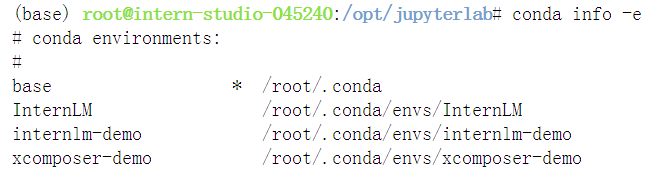
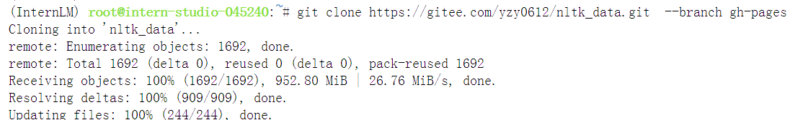
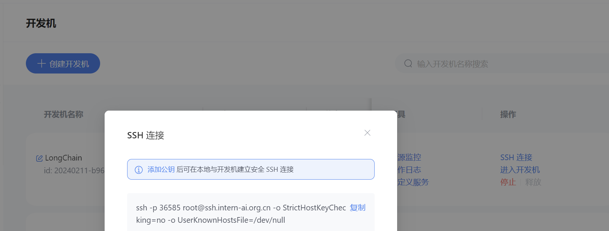
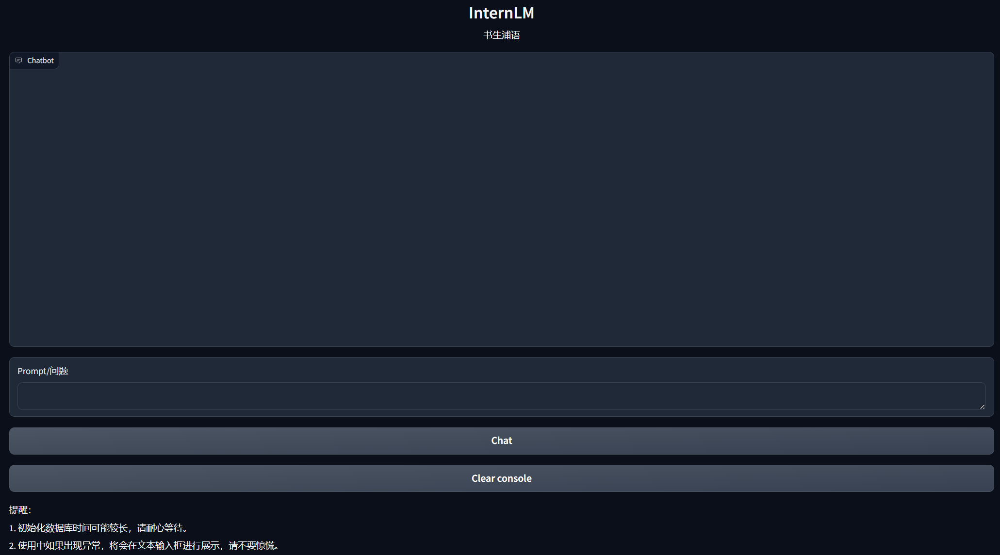
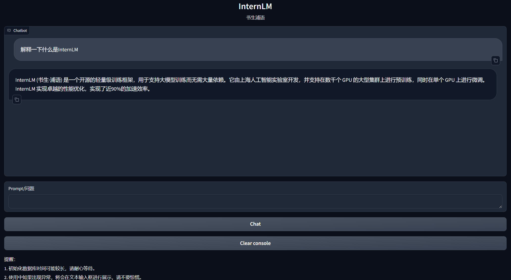

<h1 align="center">Lecture 3——HW3</h1>

## Demo 复现

### 环境配置

#### 开发机环境配置

使用 `Cuda11.7-conda` 镜像，选择 `A100(1/4)` 的配置。进入开发机之后，在终端输入 bash 命令，进入 `conda` 环境，使用以下命令从本地一个已有的 `pytorch 2.0.1` 的环境并激活 `conda` 环境：

```
bash
/root/share/install_conda_env_internlm_base.sh InternLM
conda activate InternLM
```

接下来使用 `conda info -e` 查看新环境是否创建成功：



可以看到 `InternLM` 环境已经创建成功。接下来我们在环境中安装运行 demo 所需要的依赖。

```
# 升级pip
python -m pip install --upgrade pip

pip install modelscope==1.9.5
pip install transformers==4.35.2
pip install streamlit==1.24.0
pip install sentencepiece==0.1.99
pip install accelerate==0.24.1
```

#### 模型下载

在本地的 `/root/share/temp/model_repos/internlm-chat-7b` 目录下已存储有所需的模型文件参数，可以直接拷贝到个人目录的模型保存地址：

```
mkdir -p /root/data/model/Shanghai_AI_Laboratory
cp -r /root/share/temp/model_repos/internlm-chat-7b /root/data/model/Shanghai_AI_Laboratory/internlm-chat-7b
```

#### LangChain 相关环境配置

用 `pip` 安装如下依赖包：

```
pip install langchain==0.0.292
pip install gradio==4.4.0
pip install chromadb==0.4.15
pip install sentence-transformers==2.2.2
pip install unstructured==0.10.30
pip install markdown==3.3.7
```

由于我们需要开源词向量模型 Sentence Transformer，我们首先使用 `huggingface` 官方提供的 `huggingface-cli` 命令行工具。安装依赖：

```
pip install -U huggingface_hub
```

然后在和 `/root/data` 目录下新建python文件 `download_hf.py`，使用 `huggingface` 镜像下载模型。与使用 `hugginge face` 下载相同，只需要填入镜像地址即可：

```python
import os

# 设置环境变量
os.environ['HF_ENDPOINT'] = 'https://hf-mirror.com'

# 下载模型
os.system('huggingface-cli download --resume-download sentence-transformers/paraphrase-multilingual-MiniLM-L12-v2 --local-dir /root/data/model/sentence-transformer')
```

#### 下载 NLTK 相关资源

我们在使用开源词向量模型构建开源词向量的时候，需要用到第三方库 `nltk` 的一些资源。我们可以从国内仓库镜像地址下载相关资源，保存到服务器上。输入以下命令：

```
cd /root
git clone https://gitee.com/yzy0612/nltk_data.git  --branch gh-pages
cd nltk_data
mv packages/*  ./
cd tokenizers
unzip punkt.zip
cd ../taggers
unzip averaged_perceptron_tagger.zip
```

clone 后结果如下：



#### 下载项目代码

将仓库中的所有脚本 clone 到本地：

```
cd /root/data
git clone https://github.com/InternLM/tutorial
```

### 知识库搭建

#### 数据收集

我们选择由上海人工智能实验室开源的一系列大模型工具开源仓库作为语料库来源，包括：

- [OpenCompass](https://gitee.com/open-compass/opencompass)：面向大模型评测的一站式平台
- [IMDeploy](https://gitee.com/InternLM/lmdeploy)：涵盖了 LLM 任务的全套轻量化、部署和服务解决方案的高效推理工具箱
- [XTuner](https://gitee.com/InternLM/xtuner)：轻量级微调大语言模型的工具库
- [InternLM-XComposer](https://gitee.com/InternLM/InternLM-XComposer)：浦语·灵笔，基于书生·浦语大语言模型研发的视觉-语言大模型
- [Lagent](https://gitee.com/InternLM/lagent)：一个轻量级、开源的基于大语言模型的智能体（agent）框架
- [InternLM](https://gitee.com/InternLM/InternLM)：一个开源的轻量级训练框架，旨在支持大模型训练而无需大量的依赖

将上述远程开源仓库 Clone 到本地，使用以下命令：

```
# 进入到数据库盘
cd /root/data
# clone 上述开源仓库
git clone https://gitee.com/open-compass/opencompass.git
git clone https://gitee.com/InternLM/lmdeploy.git
git clone https://gitee.com/InternLM/xtuner.git
git clone https://gitee.com/InternLM/InternLM-XComposer.git
git clone https://gitee.com/InternLM/lagent.git
git clone https://gitee.com/InternLM/InternLM.git
```

#### 加载数据

由于所有目标文件最终都需要转换成统一的纯文本文档，因此我们可以使用 `FileLoader` 对象来加载目标文件，得到由目标文件解析出的纯文本内容。不同类型的文件对应不同的 `FileLoader`。调用 `FileLoader` 对象的 load 方法来得到加载之后的纯文本对象。代码如下：

```python
from tqdm import tqdm
from langchain.document_loaders import UnstructuredFileLoader
from langchain.document_loaders import UnstructuredMarkdownLoader

def get_text(dir_path):
    # args：dir_path，目标文件夹路径
    # 首先调用上文定义的函数得到目标文件路径列表
    file_lst = get_files(dir_path)
    # docs 存放加载之后的纯文本对象
    docs = []
    # 遍历所有目标文件
    for one_file in tqdm(file_lst):
        file_type = one_file.split('.')[-1]
        if file_type == 'md':
            loader = UnstructuredMarkdownLoader(one_file)
        elif file_type == 'txt':
            loader = UnstructuredFileLoader(one_file)
        else:
            # 如果是不符合条件的文件，直接跳过
            continue
        docs.extend(loader.load())
    return docs
```

> 这里 docs 就是一个纯文本文档的列表了

#### 构建向量数据库

得到该列表之后，我们就可以将它引入到 `LangChain` 框架中构建向量数据库。由纯文本对象构建向量数据库，我们需要先对文本进行分块，接着对文本块进行向量化。此处我们使用字符串递归分割器，并选择分块大小为500，块重叠长度为150：

```python
from langchain.text_splitter import RecursiveCharacterTextSplitter

text_splitter = RecursiveCharacterTextSplitter(
    chunk_size=500, chunk_overlap=150)
split_docs = text_splitter.split_documents(docs)
```

接下来我们使用开源的 `Sentence Transformer` 来进行文本向量化。`LangChain` 提供了直接引入 `HuggingFace` 开源社区中的模型进行向量化的接口：

```python
from langchain.embeddings.huggingface import HuggingFaceEmbeddings
embeddings = HuggingFaceEmbeddings(model_name="/root/data/model/sentence-transformer")
```

我们选择 `Chroma` 作为向量数据库，基于上文分块后的文档以及加载的开源向量化模型，将语料加载到指定路径下的向量数据库：

```python
from langchain.vectorstores import Chroma

# 定义持久化路径
persist_directory = 'data_base/vector_db/chroma'
# 加载数据库
vectordb = Chroma.from_documents(
    documents=split_docs,
    embedding=embeddings,
    persist_directory=persist_directory  # 允许我们将persist_directory目录保存到磁盘上
)
# 将加载的向量数据库持久化到磁盘上
vectordb.persist()
```

### InternLM 接入 LangChain

为便捷构建 `LLM` 应用，我们需要基于本地部署的 `InternLM`，继承 `LangChain` 的 `LLM` 类自定义一个 `InternLM` `LLM` 子类，从而实现将 `InternLM` 接入到 `LangChain` 框架中。完成 `LangChain` 的自定义 `LLM` 子类之后，可以以完全一致的方式调用 `LangChain` 的接口，而无需考虑底层模型调用的不一致。

基于本地部署的 `InternLM` 自定义 `LLM` 类并不复杂，我们只需从 `LangChain.llms.base.LLM` 类继承一个子类，并重写构造函数与 `_call` 函数即可：

```python
from langchain.llms.base import LLM
from typing import Any, List, Optional
from langchain.callbacks.manager import CallbackManagerForLLMRun
from transformers import AutoTokenizer, AutoModelForCausalLM
import torch

class InternLM_LLM(LLM):
    # 基于本地 InternLM 自定义 LLM 类
    tokenizer : AutoTokenizer = None
    model: AutoModelForCausalLM = None

    def __init__(self, model_path :str):
        # model_path: InternLM 模型路径
        # 从本地初始化模型
        super().__init__()
        print("正在从本地加载模型...")
        self.tokenizer = AutoTokenizer.from_pretrained(model_path, trust_remote_code=True)
        self.model = AutoModelForCausalLM.from_pretrained(model_path, trust_remote_code=True).to(torch.bfloat16).cuda()
        self.model = self.model.eval()
        print("完成本地模型的加载")

    def _call(self, prompt : str, stop: Optional[List[str]] = None,
                run_manager: Optional[CallbackManagerForLLMRun] = None,
                **kwargs: Any):
        # 重写调用函数
        system_prompt = """You are an AI assistant whose name is InternLM (书生·浦语).
        - InternLM (书生·浦语) is a conversational language model that is developed by Shanghai AI Laboratory (上海人工智能实验室). It is designed to be helpful, honest, and harmless.
        - InternLM (书生·浦语) can understand and communicate fluently in the language chosen by the user such as English and 中文.
        """
        
        messages = [(system_prompt, '')]
        response, history = self.model.chat(self.tokenizer, prompt , history=messages)
        return response
        
    @property
    def _llm_type(self) -> str:
        return "InternLM"
```

在上述类定义中，我们分别重写了构造函数和 `_call` 函数：对于构造函数，我们在对象实例化的一开始加载本地部署的 `InternLM` 模型，从而避免每一次调用都需要重新加载模型带来的时间过长；`_call` 函数是 `LLM` 类的核心函数，`LangChain` 会调用该函数来调用 `LLM`，在该函数中，我们调用已实例化模型的 chat 方法，从而实现对模型的调用并返回调用结果。

### 部署 Web Demo

我们首先将问答链的代码内容封装为一个返回构建的检索问答链对象的函数，并在启动 `Gradio` 的第一时间调用该函数得到检索问答链对象，后续直接使用该对象进行问答对话，从而避免重复加载模型：

```python
from langchain.vectorstores import Chroma
from langchain.embeddings.huggingface import HuggingFaceEmbeddings
import os
from LLM import InternLM_LLM
from langchain.prompts import PromptTemplate
from langchain.chains import RetrievalQA

def load_chain():
    # 加载问答链
    # 定义 Embeddings
    embeddings = HuggingFaceEmbeddings(model_name="/root/data/model/sentence-transformer")

    # 向量数据库持久化路径
    persist_directory = 'data_base/vector_db/chroma'

    # 加载数据库
    vectordb = Chroma(
        persist_directory=persist_directory,  # 允许我们将persist_directory目录保存到磁盘上
        embedding_function=embeddings
    )

    # 加载自定义 LLM
    llm = InternLM_LLM(model_path = "/root/data/model/Shanghai_AI_Laboratory/internlm-chat-7b")

    # 定义一个 Prompt Template
    template = """使用以下上下文来回答最后的问题。如果你不知道答案，就说你不知道，不要试图编造答
    案。尽量使答案简明扼要。总是在回答的最后说“谢谢你的提问！”。
    {context}
    问题: {question}
    有用的回答:"""

    QA_CHAIN_PROMPT = PromptTemplate(input_variables=["context","question"],template=template)

    # 运行 chain
    qa_chain = RetrievalQA.from_chain_type(llm,retriever=vectordb.as_retriever(),return_source_documents=True,chain_type_kwargs={"prompt":QA_CHAIN_PROMPT})
    
    return qa_chain
```

接着我们定义一个类，该类负责加载并存储检索问答链，并响应 Web 界面里调用检索问答链进行回答的动作：

```python
class Model_center():
    """
    存储检索问答链的对象 
    """
    def __init__(self):
        # 构造函数，加载检索问答链
        self.chain = load_chain()

    def qa_chain_self_answer(self, question: str, chat_history: list = []):
        """
        调用问答链进行回答
        """
        if question == None or len(question) < 1:
            return "", chat_history
        try:
            chat_history.append(
                (question, self.chain({"query": question})["result"]))
            # 将问答结果直接附加到问答历史中，Gradio 会将其展示出来
            return "", chat_history
        except Exception as e:
            return e, chat_history

```

然后我们只需按照 Gradio 的框架使用方法，实例化一个 Web 界面并将点击动作绑定到上述类的回答方法即可：

```python
import gradio as gr

# 实例化核心功能对象
model_center = Model_center()
# 创建一个 Web 界面
block = gr.Blocks()
with block as demo:
    with gr.Row(equal_height=True):   
        with gr.Column(scale=15):
            # 展示的页面标题
            gr.Markdown("""<h1><center>InternLM</center></h1>
                <center>书生浦语</center>
                """)

    with gr.Row():
        with gr.Column(scale=4):
            # 创建一个聊天机器人对象
            chatbot = gr.Chatbot(height=450, show_copy_button=True)
            # 创建一个文本框组件，用于输入 prompt。
            msg = gr.Textbox(label="Prompt/问题")

            with gr.Row():
                # 创建提交按钮。
                db_wo_his_btn = gr.Button("Chat")
            with gr.Row():
                # 创建一个清除按钮，用于清除聊天机器人组件的内容。
                clear = gr.ClearButton(
                    components=[chatbot], value="Clear console")
                
        # 设置按钮的点击事件。当点击时，调用上面定义的 qa_chain_self_answer 函数，并传入用户的消息和聊天历史记录，然后更新文本框和聊天机器人组件。
        db_wo_his_btn.click(model_center.qa_chain_self_answer, inputs=[
                            msg, chatbot], outputs=[msg, chatbot])

    gr.Markdown("""提醒：<br>
    1. 初始化数据库时间可能较长，请耐心等待。
    2. 使用中如果出现异常，将会在文本输入框进行展示，请不要惊慌。 <br>
    """)
gr.close_all()
# 直接启动
demo.launch()
```

接下来我们直接用 python 命令运行，这里需要将服务器端口映射到本地端口。我们首先查看服务器端口号：



接下来我们直接在本地 powershell 终端输入以下命令：

```
ssh -CNg -L 7860:127.0.0.1:7860 root@ssh.intern-ai.org.cn -p 36585
```

此时端口映射已经完成，Demo 默认会在7860端口上运行，我们打开本地回环网址，可以看到如下结果：



我们输入问题：你是谁，查看模型的回复：

