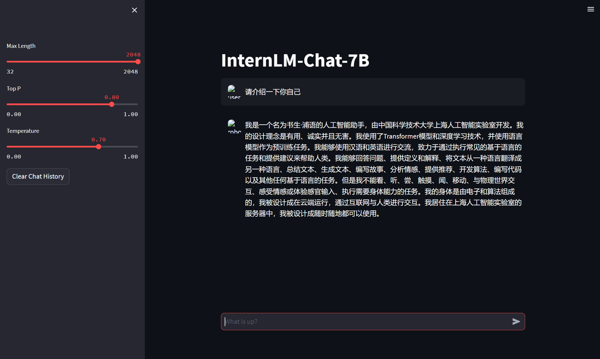

<h1 align="center">Lecture 4——HW4</h1>

## XTuner InternLM-Chat 个人小助手认知微调实践

### 环境配置

使用 `Cuda11.7-conda` 镜像，选择 `A100(1/4)` 的配置。进入开发机之后，在终端输入 bash 命令，进入 `conda` 环境，使用以下命令从本地一个已有的 `pytorch 2.0.1` 的环境并激活 `conda` 环境：

```bash
bash
conda create --name personal_assistant --clone=/root/share/conda_envs/internlm-base
conda activate personal_assistant
```

之后创建版本文件夹并进入，其中，personal_assistant 用于存放本次作业所使用的东西：

```bash
mkdir /root/personal_assistant && cd /root/personal_assistant
mkdir /root/personal_assistant/xtuner019 && cd /root/personal_assistant/xtuner01
```

从 `github` 上拉取  0.1.9 的版本源码，进入源码目录并从源码安装 `XTuner`：

```bash
git clone -b v0.1.9  https://github.com/InternLM/xtuner
cd xtuner
pip install -e '.[all]'
```

### 数据准备

创建 `data `文件夹用于存放用于训练的数据集

```bash
mkdir -p /root/personal_assistant/data && cd /root/personal_assistant/data
```

在 `data `目录下创建一个 `json` 文件 `personal_assistant.json `作为本次微调所使用的数据集。我们使用 python 脚本来生成数据集，在 `data `目录下新建一个 `generate_data.py` 文件，写入以下代码并运行脚本生成数据集：

```python
import json
# 输入你的名字
name = 'HexmSeeU'
# 重复次数
n = 10000

data = [
    {
        "conversation": [
            {
                "input": "请做一下自我介绍",
                "output": "我是{}的小助手，内在是上海AI实验室书生·浦语的7B大模型哦".format(name)
            }
        ]
    }
]

for i in range(n):
    data.append(data[0])

with open('personal_assistant.json', 'w', encoding='utf-8') as f:
    json.dump(data, f, ensure_ascii=False, indent=4)

```

### 配置准备

使用以下命令下载全系列的 `InternLM` 模型：

```bash
mkdir -p /root/personal_assistant/model/Shanghai_AI_Laboratory
cp -r /root/share/temp/model_repos/internlm-chat-7b /root/personal_assistant/model/Shanghai_AI_Laboratory
```

创建用于存放配置文件的文件夹 `config` 并进入：

```bash
mkdir /root/personal_assistant/config && cd /root/personal_assistant/config
```

拷贝一个配置文件到当前目录：

```bash
xtuner copy-cfg internlm_chat_7b_qlora_oasst1_e3 .
```

运行结果如下：


修改拷贝后的文件 `internlm_chat_7b_qlora_oasst1_e3_copy.py`：

```python
# PART 1 中
# 预训练模型存放的位置
pretrained_model_name_or_path = '/root/personal_assistant/model/Shanghai_AI_Laboratory/internlm-chat-7b'

# 微调数据存放的位置
data_path = '/root/personal_assistant/data/personal_assistant.json'

# 训练中最大的文本长度
max_length = 512

# 每一批训练样本的大小
batch_size = 2

# 最大训练轮数
max_epochs = 3

# 验证的频率
evaluation_freq = 90

# 用于评估输出内容的问题（用于评估的问题尽量与数据集的question保持一致）
evaluation_inputs = [ '请介绍一下你自己', '请做一下自我介绍' ]


# PART 3 中
dataset=dict(type=load_dataset, path='json', data_files=dict(train=data_path))
dataset_map_fn=None
```

### 微调启动

用 `xtuner train` 启动训练：

```bash
xtuner train /root/personal_assistant/config/internlm_chat_7b_qlora_oasst1_e3_copy.py
```

训练结果如下：


可以发现模型的问答训练成了我们想要的样子。

### 参数转换并合并

将训练后的 `pth` 格式参数转 `Hugging Face` 格式：

```bash
# 创建用于存放Hugging Face格式参数的hf文件夹
mkdir /root/personal_assistant/data/work_dirs/hf

export MKL_SERVICE_FORCE_INTEL=1

# 配置文件存放的位置
export CONFIG_NAME_OR_PATH=/root/personal_assistant/data/internlm_chat_7b_qlora_oasst1_e3_copy.py

# 模型训练后得到的pth格式参数存放的位置
export PTH=/root/personal_assistant/data/work_dirs/internlm_chat_7b_qlora_oasst1_e3_copy/epoch_3.pth

# pth文件转换为Hugging Face格式后参数存放的位置
export SAVE_PATH=/root/personal_assistant/data/work_dirs/hf

# 执行参数转换
xtuner convert pth_to_hf $CONFIG_NAME_OR_PATH $PTH $SAVE_PATH
```

> 这里开始和实验指导不一样的地方是由于我的 `work_dirs` 文件夹保存在了 `/root/personal_assistant/data` 目录下，因此需要修改路径

结果如下：


合并模型参数：

```bash
export MKL_SERVICE_FORCE_INTEL=1
export MKL_THREADING_LAYER='GNU'

# 原始模型参数存放的位置
export NAME_OR_PATH_TO_LLM=/root/personal_assistant/model/Shanghai_AI_Laboratory/internlm-chat-7b

# Hugging Face格式参数存放的位置
export NAME_OR_PATH_TO_ADAPTER=/root/personal_assistant/data/work_dirs/hf

# 最终Merge后的参数存放的位置
mkdir /root/personal_assistant/data/work_dirs/hf_merge
export SAVE_PATH=/root/personal_assistant/data/work_dirs/hf_merge

# 执行参数Merge
xtuner convert merge \
    $NAME_OR_PATH_TO_LLM \
    $NAME_OR_PATH_TO_ADAPTER \
    $SAVE_PATH \
    --max-shard-size 2GB
```

结果如下：


### 网页 Demo

安装网页 Demo 所需要的依赖：

```bash
pip install streamlit==1.24.0
```

下载 `InternLM` 项目代码：

```bash
# 创建code文件夹用于存放InternLM项目代码
mkdir /root/personal_assistant/code && cd /root/personal_assistant/code
git clone https://github.com/InternLM/InternLM.git
```

将 `/root/code/InternLM/web_demo.py` 中 29 行和 33 行的模型路径更换为Merge后存放参数的路径 `/root/personal_assistant/config/work_dirs/hf_merge`

运行 `/root/personal_assistant/code/InternLM` 目录下的 `web_demo.py` 文件，输入以下命令后将端口映射到本地。在本地浏览器输入 `http://127.0.0.1:6006` 即可。

```bash
streamlit run /root/personal_assistant/code/InternLM/web_demo.py --server.address 127.0.0.1 --server.port 6006
```

### 效果

|       微调前        |       微调后        |
| :-----------------: | :-----------------: |
|  |  |

