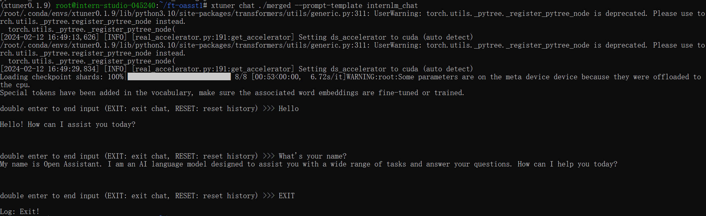
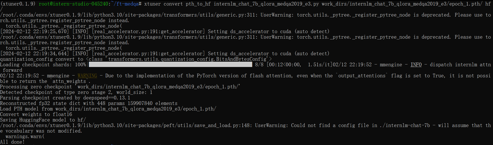

<h1 align="center">Xtuner 大模型单卡低成本微调实战</h1>

## FineTune 简介

LM 的下游应用中，增量预训练和指令跟随是经常会用到两种的微调模式。


### 增量预训练微调

使用场景：让基座模型学习到一些新知识，如某个垂类领域的尝试
训练数据：文章、书籍、代码等

### 指令跟随微调

使用场景：让模型学会对话模板，根据人类指令进行对话
训练数据：高质量的对话，问答数据

#### 对话模板

在实际对话时，通常会有三种角色：

1. System：给定一些上下文信息，比如“你是一个安全的AI助手”
2. User：实际用户，会提出一些问题。比如**“世界第一高峰是？”**
3. Assistant：根据 User 的输入，结合 System 的上下文信息，做出回答，比如**“珠穆朗玛峰”**

对话模板是为了让 LLM 能够区分出 System、User、Assistant。不同的哦行会有不同的模板。

> eg. LlaMa 2
>
> ```
> <<SYS>>		System上下文开始
> <</SYS>>	System上下文结束
> [INST]		User指令开始
> [/INST]		User指令结束
> ```

### LoRA & QLoRA

`LoRA`：LOW-RANK ADAPTATION OF LARGE LANGUAGE MODELS

`LLM` 的参数量主要集中在模型中的 Linear，训练这些参数会消耗大量的显存。

`LoRA` 通过在原本的 Linear 旁，新增一个支路，包含两个连续的小 Linear，新增的这个支路叫做 Adapter

Adapter 参数量远小于原本的 Linear，能大幅降低训练的显存消耗


> 全参数微调：整个模型加载到显存中，模型参数和优化器加载到显存中
>
> `LoRA` 微调：模型加载到显存中，只需要保存 `LoRA` 部分的优化器
>
> QLoRA 微调：加载模型时使用4 bit 量化方式加载，参数优化器可以在 CPU 和GPU 之间调度（显存满了去内存跑）

## XTuner 微调框架

XTuner 是打包好的大模型微调工具箱，支持从 huggingface 和 modelscope 加载模型和数据集。支持多款开源大模型

### XTuner 数据引擎

#### 数据处理流程

1. 原始问答对 $\to$ 格式化问答对
2. 格式化问答对 $\to$ 可训练语料

支持多数据样本拼接（Packet Dataset）

## 8GB 显存玩转 LLM

`Flash Attetion` 和 `DeepSpeed ZeRO` 是 `XTuner` 最重要的两个优化技巧。

### Flash Attetion

`Flash Attetion` 将 Attention 计算并行化，避免了计算过程中 Attention Score $N\times N$ 的显存占用

### DeepSpeed ZeRO

`ZeRO` 优化，通过将训练过程中的参数、梯度和优化器状态切片保存，能够在多 GPU 训练时显著节省显存。

除了将训练中间状态切片外，`DeepSpeed` 训练时使用 `FP16` 的权重，相较于 `Pytorch` 的 AMP 训练，在单 GPU 上也能大幅节省显存。

## 快速上手

### 环境配置

使用 `Cuda11.7-conda` 镜像，选择 `A100(1/4)` 的配置。进入开发机之后，在终端输入 bash 命令，进入 `conda` 环境，使用以下命令从本地一个已有的 `pytorch 2.0.1` 的环境并激活 `conda` 环境：

```
/root/share/install_conda_env_internlm_base.sh xtuner0.1.9
conda activate xtuner0.1.9
```

之后在 root 目录下创建版本文件夹并进入，拉取 `xtuner 0.1.9` 的版本源码。随后进入源码目录，从源码安装 `xtuner`：

```
cd ~
mkdir xtuner019 && cd xtuner019
git clone -b v0.1.9  https://github.com/InternLM/xtuner
cd xtuner
pip install -e '.[all]'
```

最后创建一个微调 `oasst1` 数据集的工作路径并进入：

### 微调

#### 准备配置文件

`xtuner` 提供了多个开箱即用的配置文件，可以通过如下命令进行查看：

```
xtuner list-cfg
```

j得到的内置配置结果如下：


拷贝一个配置文件到当前目录：

```
cd ~/ft-oasst1
xtuner copy-cfg internlm_chat_7b_qlora_oasst1_e3 .
```

> 配置文件名的解释：
>
> |     模型名     |  interlm_chat_7b   |
> | :------------: | :----------------: |
> |    使用算法    |       qlora        |
> |     数据集     |       oasst1       |
> | 把数据集跑几次 | 跑3次：e3(epoch 3) |

#### 模型下载

使用下面的命令直接复制模型：

```
ln -s /share/temp/model_repos/internlm-chat-7b ~/ft-oasst1/
```

> 这是通过软链的方式将模型文件挂载到 root 目录下，优势是：
>
> 1. 节省拷贝时间，无需等待
> 2. 节省用户开发机存储时间
>
> 当然，也可以用 `cp -r /share/temp/model_repos/internlm-chat-7b ~/ft-oasst1/` 进行数据拷贝。

数据集下载

由于数据集已经提前下载好，因此我们只需要将数据集复制到正确的位置即可：

```
cd ~/ft-oasst1
cp -r /root/share/temp/datasets/openassistant-guanaco .
```

当前路径的文件如下：

```
|-- internlm-chat-7b
|   |-- README.md
|   |-- config.json
|   |-- configuration.json
|   |-- configuration_internlm.py
|   |-- generation_config.json
|   |-- modeling_internlm.py
|   |-- pytorch_model-00001-of-00008.bin
|   |-- pytorch_model-00002-of-00008.bin
|   |-- pytorch_model-00003-of-00008.bin
|   |-- pytorch_model-00004-of-00008.bin
|   |-- pytorch_model-00005-of-00008.bin
|   |-- pytorch_model-00006-of-00008.bin
|   |-- pytorch_model-00007-of-00008.bin
|   |-- pytorch_model-00008-of-00008.bin
|   |-- pytorch_model.bin.index.json
|   |-- special_tokens_map.json
|   |-- tokenization_internlm.py
|   |-- tokenizer.model
|   `-- tokenizer_config.json
|-- internlm_chat_7b_qlora_oasst1_e3_copy.py
`-- openassistant-guanaco
    |-- openassistant_best_replies_eval.jsonl
    `-- openassistant_best_replies_train.jsonl
```

#### 修改配置文件

在 `internlm_chat_7b_qlora_oasst1_e3_copy.py` 中修改数据集和模型为本地路径（减号代表要删除的行，加号代表要增加的行）：

```
# 修改模型为本地路径
- pretrained_model_name_or_path = 'internlm/internlm-chat-7b'
+ pretrained_model_name_or_path = './internlm-chat-7b'

# 修改训练数据集为本地路径
- data_path = 'timdettmers/openassistant-guanaco'
+ data_path = './openassistant-guanaco'
```

#### 开始微调

利用 `QLoRA` 算法在 `oastt1` 数据集上微调 `InternLM-7B`：

```
xtuner train ./internlm_chat_7b_qlora_oasst1_e3_copy.py
```

得到的运行时间如下：


随后尝试使用 `deepspeed` 进行加速，运行时间如下：


训练部分过程如下：


可以看到使用 `deepspeed` 后训练时间显著缩短。训练跑完之后，路径如下：

```
|-- internlm-chat-7b
|-- internlm_chat_7b_qlora_oasst1_e3_copy.py
|-- openassistant-guanaco
|   |-- openassistant_best_replies_eval.jsonl
|   `-- openassistant_best_replies_train.jsonl
`-- work_dirs
    `-- internlm_chat_7b_qlora_oasst1_e3_copy
        |-- 20231101_152923
        |   |-- 20231101_152923.log
        |   `-- vis_data
        |       |-- 20231101_152923.json
        |       |-- config.py
        |       `-- scalars.json
        |-- epoch_1.pth
        |-- epoch_2.pth
        |-- epoch_3.pth
        |-- internlm_chat_7b_qlora_oasst1_e3_copy.py
        `-- last_checkpoint
```

#### 将得到的 PTH 模型转换为 HuggingFace 模型

输入如下命令：

```
mkdir hf
export MKL_SERVICE_FORCE_INTEL=1
export MKL_THREADING_LAYER=GNU
xtuner convert pth_to_hf ./internlm_chat_7b_qlora_oasst1_e3_copy.py ./work_dirs/internlm_chat_7b_qlora_oasst1_e3_copy/epoch_1.pth ./hf
```

查看路径：


#### 部署与测试

将 `HuggingFace adapter` 合并到大语言模型：

```
xtuner convert merge ./internlm-chat-7b ./hf ./merged --max-shard-size 2GB
```

查看合并后的路径：


随后与合并后的模型对话：

```
xtuner chat ./merged --prompt-template internlm_chat
```

聊天过程如下：

|       微调前        |       微调后       |
| :-----------------: | :----------------: |
|  |  |

### 自定义微调

基于 `InternLM-chat-7B` 模型，用 `MedQA` 数据集进行微调，将其往**医学问答**领域对齐。首先使用 python 脚本，将 `.xlsx` 中的问题和回答两列提取出来，再放入 `.jsonL` 文件中的每个 conversation 的 input 和 output 中。

之后新建一个文件夹来微调自定义数据集，并把前面下载好的 `internlm-chat-7b` 模型文件夹拷贝过来，再把自定义数据集传入到服务器上：

```
mkdir ~/ft-medqa && cd ~/ft-medqa
cp -r ~/ft-oasst1/internlm-chat-7b .
git clone https://github.com/InternLM/tutorial
cp ~/tutorial/xtuner/MedQA2019-structured-train.jsonl .
```

#### 准备配置文件

首先复制配置文件到当前目录，改文件名：

```
xtuner copy-cfg internlm_chat_7b_qlora_oasst1_e3 .
mv internlm_chat_7b_qlora_oasst1_e3_copy.py internlm_chat_7b_qlora_medqa2019_e3.py
```

随后修改配置文件内容，其中减号代表要删除的行，加号代表要增加的行。：

```python
# 修改import部分
- from xtuner.dataset.map_fns import oasst1_map_fn, template_map_fn_factory
+ from xtuner.dataset.map_fns import template_map_fn_factory

# 修改模型为本地路径
- pretrained_model_name_or_path = 'internlm/internlm-chat-7b'
+ pretrained_model_name_or_path = './internlm-chat-7b'

# 修改训练数据为 MedQA2019-structured-train.jsonl 路径
- data_path = 'timdettmers/openassistant-guanaco'
+ data_path = 'MedQA2019-structured-train.jsonl'

# 修改 train_dataset 对象
train_dataset = dict(
    type=process_hf_dataset,
-   dataset=dict(type=load_dataset, path=data_path),
+   dataset=dict(type=load_dataset, path='json', data_files=dict(train=data_path)),
    tokenizer=tokenizer,
    max_length=max_length,
-   dataset_map_fn=alpaca_map_fn,
+   dataset_map_fn=None,
    template_map_fn=dict(
        type=template_map_fn_factory, template=prompt_template),
    remove_unused_columns=True,
    shuffle_before_pack=True,
    pack_to_max_length=pack_to_max_length)
```

#### 微调

按照同样的方式对模型进行微调：

```
xtuner train internlm_chat_7b_qlora_medqa2019_e3.py --deepspeed deepspeed_zero2
```

将得到的 `PTH` 模型转换为 `HuggingFace` 模型（与前面的步骤类似）：



输入同样的问题与模型进行对话：

