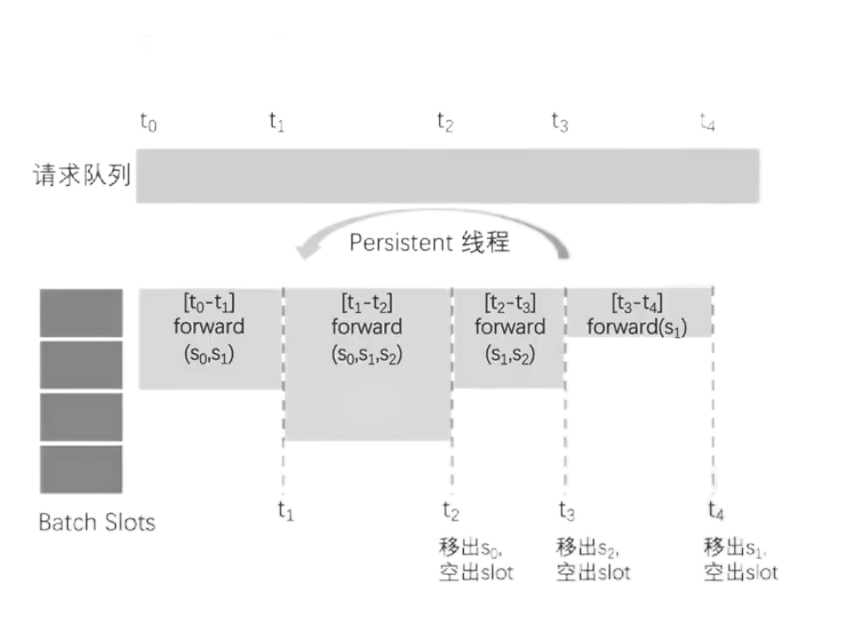
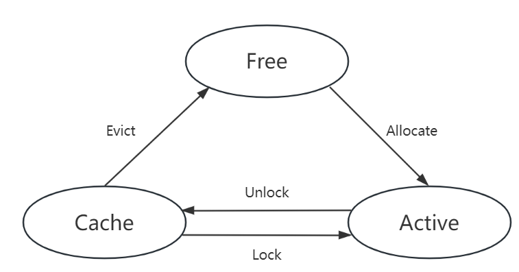
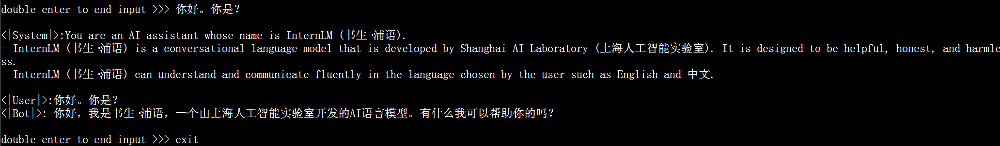
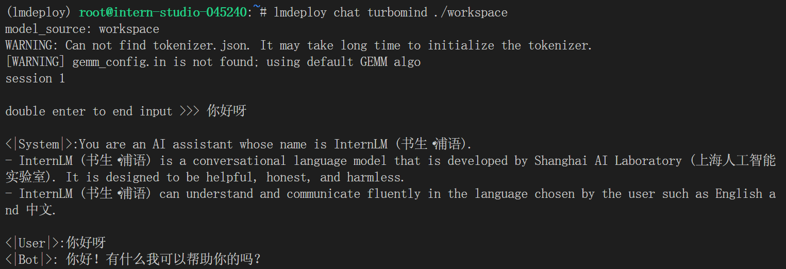
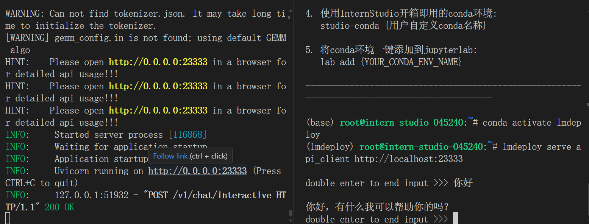
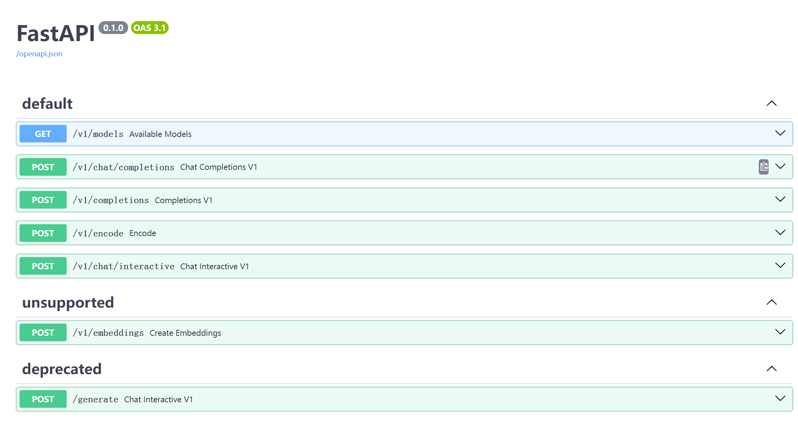
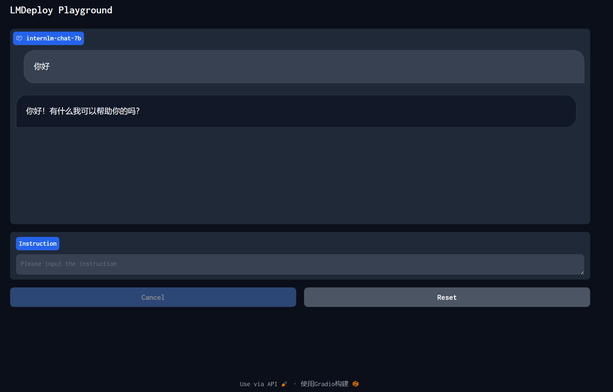
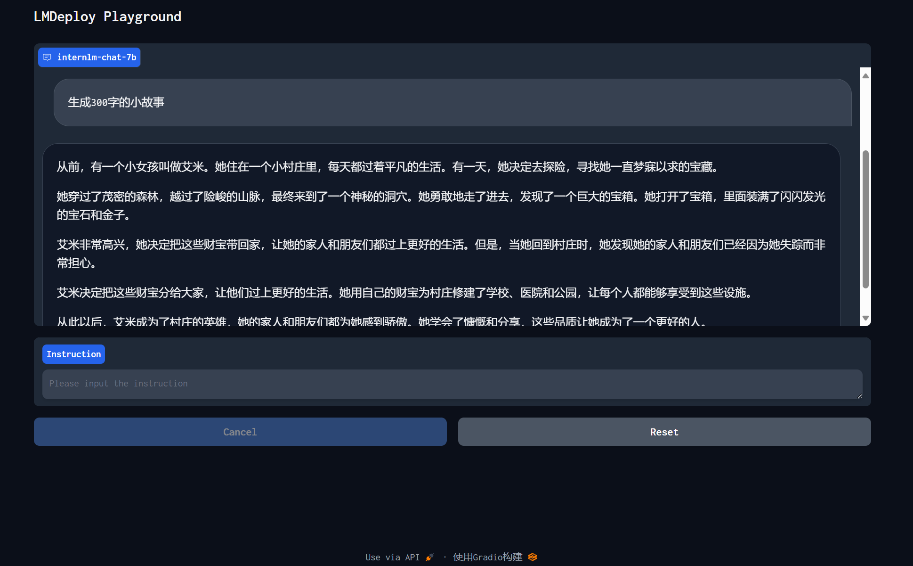

<h1 align="center">LMDeploy 大模型量化部署实践</h1>

## 大模型部署背景

### 模型部署

定义：

- 将训练好的模型在特定软硬件环境中启动的过程，使模型能够接收输入并返回预测结果
- 为了满足性能和效率的需求，常常需要对模型进行优化，例如模型压缩和硬件加速

产品形态：

- 云端、边缘计算端、移动端

计算设备：

- CPU、GPU、NPU、TPU 等

### 大模型特点

1. 内存开销巨大
   1. 庞大的参数量
   2. 采用自回归生成 token，需要缓存 Attention 的 k/v，带来巨大的内存开销
2. 动态 shape
   1. 请求数不固定
   2. Token 逐个生成，且数量不定
3. 相对视觉模型，`LLM` 结构简单
   1. `Transformer` 结构，大部分是 `decoder-only`

### 大模型部署挑战

1. 设备
   1. 如何应对巨大的存储问题，低存储设备如何部署
2. 推理
   1. 如何加速 token 生成速度
   2. 如何解决动态 shape，让推理可以不间断
   3. 如何有效管理和利用内存
3. 服务
   1. 如何提升系统整体吞吐量
   2. 对于个体用户，如何降低响应时间

### 大模型部署方案

1. 技术点

   1. 模型并行
   2. 低比特量化
   3. `transformer` 计算和访存优化

2. 方案

   `huggingface transformers` / 专门的推理加速框架

   1. 云端
      1. `Imdeploy`
      2. `vllm`
      3. `deepspeed`
   2. 移动端
      1. `mlc-llm`
      2. `llama.cpp`

## LMDeploy 简介

`LMDeploy` 是 `LLM` 在英伟达设备上部署的全流程解决方案。包括模型轻量化、推理、服务

特点：

1. 高效推理引擎
   - 持续批处理技巧
   - Block k/v cache
   - 深度优化的计算 kernels
   - 动态分割与融合
2. 完备易用的工具链
   - 量化、推理、服务全流程
   - 无缝对接 `opencompass` 评测推理精度
   - 多维度推理速度评测工具
3. 支持交互式推理，不为历史对话买单

### 核心功能——量化

#### 为什么作 Weight Only 的量化？

**两个基本概念**

- 计算密集：推理的绝大部分时间消耗在数值计算上；针对计算密集场景，可以通过使用更快的硬件计算单元来提升计算速度，比如量化为 `W8A8` 使用 `INT8 Tensor Core` 来加速计算
- 访存密集：推理时，绝大部分时间消耗在数据读取上；针对方寸密集型场景，一般是通过提高计算访存来提高性能

`LLM` 是典型的访存密集型任务。常见的 `LLM` 模型是 `Decoder Only` 架构。推理时大部分时间消耗在逐 Token 生成阶段（Decoding 阶段），是典型的访存密集型场景。

`Weight Only` 量化一举多得：

- 4 bit Weight Only 量化，将 `FP16` 的模型权重量化为 `INT4`，访存量直接降为 `FP16` 模型的 1/4，大幅降低了访存成本，提高了 Decoding 的速度。
- 加速的同时还节省了显存，同样的设备能够支持更大的模型以及更长的对话长度

#### 如何作 Weight Only 的量化？

- `LMDeploy` 使用 `AWQ` 算法，量化为 4 bit 模型
- 推理时，先把 4 bit 权重反量化回 `FP16`（在 Kernel 内部进行，从 Global Memory 读取时仍然是 4 bit），依旧使用的是 FP16 计算
- 相较于社区使用较多的 GPTU 算法，AWQ 的推理速度更快，量化的时间更短

> 通过观察相对重要的参数集中在比较小的区域内，因此可以针对这点进行设计

### 核心功能——推理引擎 TurboMind

#### 持续批处理

请求队列

- 推理请求首先先加入到请求队列中

Persistent 线程

1. 若 batch 中有空闲槽位，从队列中拉取请求，尽量填满空闲槽位。若无，继续对当前 batch 中的请求进行 forward
2. Batch 每 forward 完一次
   1. 判断是否有 request 推理结束。结束的 request，发送结果，释放槽位
   2. 转步骤1



#### 有状态的推理

第一次请求 `(U1)` 到达，创建新的序列。推理完成后，输入、输出 token，以及 `k/v block` 会保存下来。当后续请求 `(U1, U2)` 到达，命中序列。推理完成后，输入、输出 token 更新到序列的 token 数组，新申请的 `k/v block` 加入到序列的 block 数组中

#### Blocked k/v cache

支持 Paged Attention、支撑有状态推理
$$
BlockSize=2\times Layers \times Heads \times HeadDim \times Seq \times B
$$
其中，$Seq$ 表示1个 block 里的序列长度，默认128；$B$ 表示 k/v 数值精度对应的字节数



Block 状态：

- Free 未被任何序列占用
- Active 被正在推理的序列占用
- Cache 被缓存中的序列占用

## Demo 演示

### 环境配置

使用如下命令配置 conda 环境，并激活环境：

```bash
/root/share/install_conda_env_internlm_base.sh lmdeploy
conda activate lmdeploy
```

接下来安装 Imdeploy：

```
# 解决 ModuleNotFoundError: No module named 'packaging' 问题
pip install packaging
# 使用 flash_attn 的预编译包解决安装过慢问题
pip install /root/share/wheels/flash_attn-2.4.2+cu118torch2.0cxx11abiTRUE-cp310-cp310-linux_x86_64.whl
pip install 'lmdeploy[all]==v0.1.0'
```

### 模型部署

从架构上把整个服务流程分成下面几个模块：

- 模型推理/服务。主要提供模型本身的推理，一般来说可以和具体业务解耦，专注模型推理本身性能的优化。可以以模块、API等多种方式提供。
- Client。可以理解为前端，与用户交互的地方。
- API Server。一般作为前端的后端，提供与产品和服务相关的数据和功能支持。

#### 模型转换

使用 TurboMind 推理模型需要先将模型转化为 TurboMind 的格式，目前支持在线转换和离线转换两种形式。在线转换可以直接加载 Huggingface 模型，离线转换需需要先保存模型再加载。

##### 在线转换

lmdeploy 支持直接读取 Huggingface 模型权重，示例如下：

```bash
lmdeploy chat turbomind internlm/internlm-chat-20b-4bit --model-name internlm-chat-20b
lmdeploy chat turbomind Qwen/Qwen-7B-Chat --model-name qwen-7b
```

上面两行命令分别展示了如何直接加载 Huggingface 的模型，第一条命令是加载使用 lmdeploy 量化的版本，第二条命令是加载其他 LLM 模型。

我们也可以直接启动本地的 Huggingface 模型，如下所示：

```bash
lmdeploy chat turbomind /share/temp/model_repos/internlm-chat-7b/  --model-name internlm-chat-7b
```

通过 bash 与 LLM 对话结果如下：



##### 离线转换

离线转换需要在启动服务之前，将模型转为 lmdeploy TurboMind 的格式，如下所示：

```bash
# 转换模型（FastTransformer格式） TurboMind
lmdeploy convert internlm-chat-7b /path/to/internlm-chat-7b
```

这里我们使用官方提供的模型文件，就在用户根目录执行，如下所示：

```bash
lmdeploy convert internlm-chat-7b  /root/share/temp/model_repos/internlm-chat-7b/
```

执行完成后将会在当前目录生成一个 `workspace` 的文件夹。这里面包含的就是 TurboMind 和 Triton “模型推理”需要到的文件。

### TurboMind 推理 + 命令行本地对话

模型转换完成后，我们就具备了使用模型推理的条件，接下来就可以进行真正的模型推理环节。执行命令如下：

```bash
# Turbomind + Bash Local Chat
lmdeploy chat turbomind ./workspace
```

对话结果如下：



### TurboMind推理+API服务

在上面的部分我们尝试了直接用命令行启动 Client，接下来我们尝试如何运用 lmdepoy 进行服务化。首先，通过下面命令启动服务。

```bash
# ApiServer+Turbomind   api_server => AsyncEngine => TurboMind
lmdeploy serve api_server ./workspace \
	--server_name 0.0.0.0 \
	--server_port 23333 \
	--instance_num 64 \
	--tp 1
```

然后，我们可以新开一个窗口，执行下面的 Client 命令。如果使用官方机器，可以打开 vscode 的 Terminal，执行下面的命令。

```bash
# ChatApiClient+ApiServer（注意是http协议，需要加http）
lmdeploy serve api_client http://localhost:23333
```

对话结果如下：



刚刚我们启动的是 API Server，自然也有相应的接口。可以直接打开 `http://{host}:23333` 查看，如下图所示。



### 网页 Demo 演示

#### TurboMind 服务作为后端

API Server 的启动和上一节一样，这里直接启动作为前端的 Gradio。

```bash
# Gradio+ApiServer。必须先开启 Server，此时 Gradio 为 Client
lmdeploy serve gradio http://0.0.0.0:23333 \
	--server_name 0.0.0.0 \
	--server_port 6006 \
	--restful_api True
```

结果如下图所示。



#### TurboMind 推理作为后端

Gradio 也可以直接和 TurboMind 连接，如下所示。

```bash
# Gradio+Turbomind(local)
lmdeploy serve gradio ./workspace
```

可以直接启动 Gradio，此时没有 API Server，TurboMind 直接与 Gradio 通信。如下图所示。



### 模型量化

#### KV Cache 量化

KV Cache 量化是将已经生成序列的 KV 变成 Int8，使用过程一共包括三步：

第一步：计算 minmax。主要思路是通过计算给定输入样本在每一层不同位置处计算结果的统计情况。

- 对于 Attention 的 K 和 V：取每个 Head 各自维度在所有Token的最大、最小和绝对值最大值。对每一层来说，上面三组值都是 `(num_heads, head_dim)` 的矩阵。这里的统计结果将用于本小节的 KV Cache。
- 对于模型每层的输入：取对应维度的最大、最小、均值、绝对值最大和绝对值均值。每一层每个位置的输入都有对应的统计值，它们大多是 `(hidden_dim, )` 的一维向量，当然在 FFN 层由于结构是先变宽后恢复，因此恢复的位置维度并不相同。这里的统计结果用于下个小节的模型参数量化，主要用在缩放环节。

第一步执行命令如下：

```bash
# 计算 minmax
lmdeploy lite calibrate \
  --model  /root/share/temp/model_repos/internlm-chat-7b/ \
  --calib_dataset "c4" \
  --calib_samples 128 \
  --calib_seqlen 2048 \
  --work_dir ./quant_output
```

第二步：通过 minmax 获取量化参数。获取每一层的 KV 中心值（zp）和缩放值（scale）。执行命令如下：

```bash
# 通过 minmax 获取量化参数
lmdeploy lite kv_qparams \
  --work_dir ./quant_output  \
  --turbomind_dir workspace/triton_models/weights/ \
  --kv_sym False \
  --num_tp 1
```

第三步：修改配置。也就是修改 `weights/config.ini` 文件。只需要把 `quant_policy` 改为 4 即可。

#### W4A16 量化

W4A16中的A是指Activation，保持FP16，只对参数进行 4bit 量化。使用过程也可以看作是三步。

第一步同上

第二步：量化权重模型。利用第一步得到的统计值对参数进行量化，具体又包括两小步：

- 缩放参数。主要是性能上的考虑（回顾 PPT）。
- 整体量化。

第二步的执行命令如下：

```bash
# 量化权重模型
lmdeploy lite auto_awq \
  --model  /root/share/temp/model_repos/internlm-chat-7b/ \
  --w_bits 4 \
  --w_group_size 128 \
  --work_dir ./quant_output 
```

最后一步：转换成 TurboMind 格式。

```bash
# 转换模型的layout，存放在默认路径 ./workspace 下
lmdeploy convert  internlm-chat-7b ./quant_output \
    --model-format awq \
    --group-size 128
```

